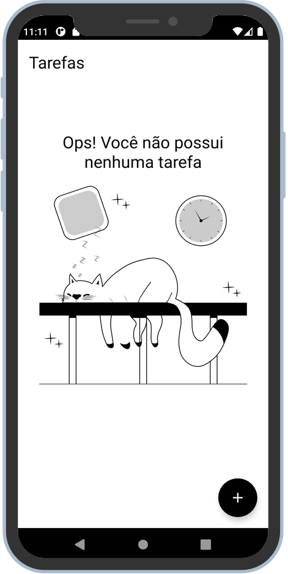
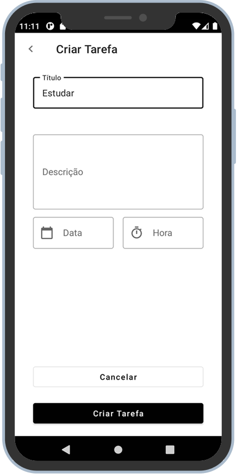
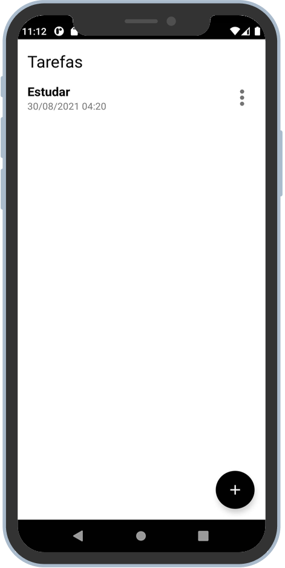

<h1 align="center">
    
</h1>

<h4 align="center"> 
  Santander Bootcamp Mobile
</h4>

  

  
  
  

  

  
   

  <a href="#rocket-technology">Technology</a>&nbsp;&nbsp;&nbsp;|&nbsp;&nbsp;&nbsp;
  <a href="#-project">Project</a>&nbsp;&nbsp;&nbsp;|&nbsp;&nbsp;&nbsp;
  <a href="#-screenshots">Screenshots</a>&nbsp;&nbsp;&nbsp;|&nbsp;&nbsp;&nbsp;
  <a href="#memo-license">License</a>

 

## :rocket: Technology

For the development of this project it was used the following technology stack:

- :earth_americas: **[Kotlin](https://kotlinlang.org/)** — Kotlin language
- :file_cabinet: **[Room persistence library](https://developer.android.com/jetpack/androidx/releases/room)** — The Room persistence library provides an abstraction layer over SQLite to allow for more robust database access while harnessing the full power of SQLite
- ⚛️ **[Constraint Layout](https://developer.android.com/training/constraint-layout)** — Layout to build a responsive UI

## 💻 Project

ToDO is project developed during the Santander Bootcamp Mobile, developed in Kotlin language it aims to be a simple To Do list app using Room persistence library to keep its data.

## 🔖 Screenshots

## :memo: License

This project is under MIT License. Check the file [LICENSE](LICENSE.md) for more details.

---

Developed with :sparkling_heart: and ☕ by Robson Lima for Digital Innovation One - Santander Mobile Bootcamp